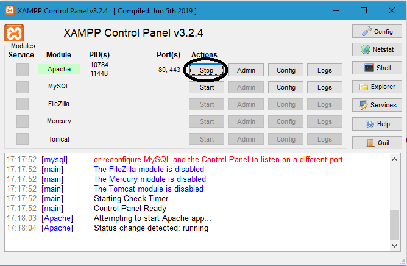

# Mean-Average

Miguel Fernando Ramos García

Proyecto Integrador 1

# About this project

This project is based in the knowledge learned in the course Building Web Applications in PHP.

# Tools

For execute this program I suggest the use of XAMPP (Windows) or MAMP (Mac and Windows), this are an interpreters for scripts written in the PHP.
https://www.apachefriends.org/es/index.html (XAMPP)
https://www.mamp.info/en/windows/ (MAMP)

After download this program, go to the main folder of the program and open htdocs. 
Once located htdocs download this repository as zip file in that folder and unzip.

# How to use
Firts of all open the program that you dowloaded (in my case XAMPP) and start the apache

Aferter that, go to your local host
(This is in my case)
http://localhost/Php-project/
And continue as I explained the use in this tutorail 
https://www.youtube.com/watch?v=d4dX4dmBW6w

